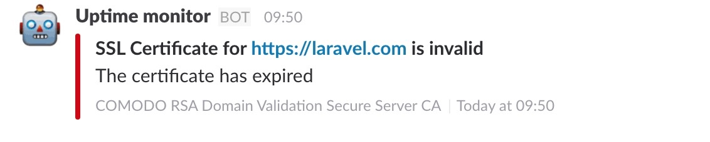
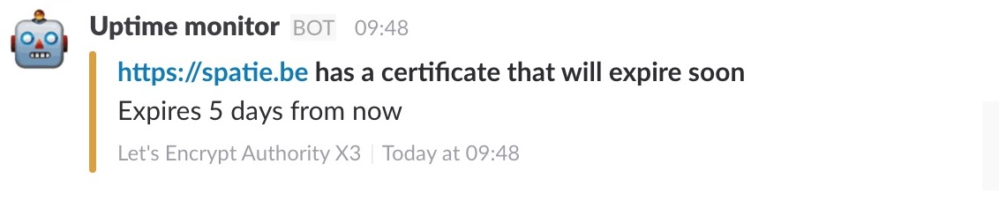

The package can notify you when certain events take place when running the ssl certificate check. You can specify which channels the notifications for certain events should be sent in the config file. If you don't want notifications for a certain event, just pass an empty array. `slack` and `mail` channels are supported out of the box. If you want to use another channel or want to modify the notifications read the section on [customizing notifications](https://docs.spatie.be/laravel-uptime-monitor/v3/advanced-usage/customizing-notifications).

## CertificateCheckFailed

`Spatie\UptimeMonitor\Notifications\Notifications\CertificateCheckFailed`

This notification will be sent when the `Spatie\UptimeMonitor\Events\CertificateCheckFailed` event is fired.

This is how the notification looks in Slack.

## CertificateExpiresSoon

`Spatie\UptimeMonitor\Notifications\Notifications\CertificateExpiresSoon`

This notification will be sent when the `Spatie\UptimeMonitor\Events\CertificateExpiresSoon` event is fired.

This is how the notification looks in Slack.

## CertificateCheckSucceeded

`Spatie\UptimeMonitor\Notifications\Notifications\CertificateCheckSucceeded`

This notification will be sent when the `Spatie\UptimeMonitor\Events\CertificateCheckSucceeded` event was fired.

Probably you don't want to be notified of this event as it is fired many many times. 
