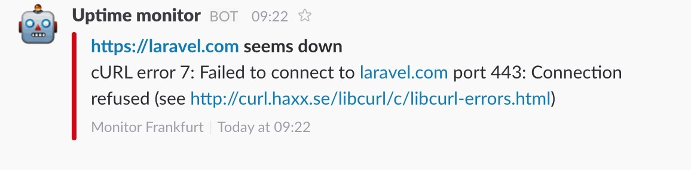
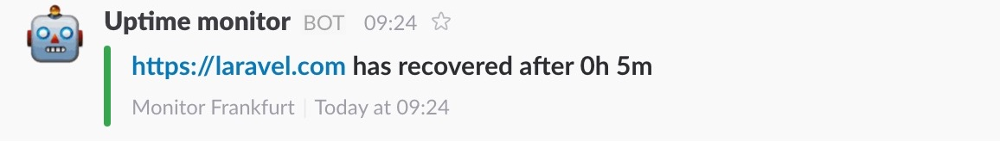

The package notifies you if certain events take place when running the uptime check. You can specify which channels the notifications for certain events should be sent in the config file. If you don't want any notifications for a certain event, just pass an empty array. Out of the box `slack` and `mail` are supported. If you want to use another channel or modify the notifications, read the section on [customizing notifications](https://docs.spatie.be/laravel-uptime-monitor/v3/advanced-usage/customizing-notifications).

## UptimeCheckFailed

`Spatie\UptimeMonitor\Notifications\Notifications\UptimeCheckFailed`

This notification will be sent when the `Spatie\UptimeMonitor\Events\UptimeCheckFailed` event is fired.

This is how the notification looks in Slack.

## UptimeCheckRecovered

`Spatie\UptimeMonitor\Notifications\Notifications\UptimeCheckRecovered`

This notification will be sent when the `Spatie\UptimeMonitor\Events\UptimeCheckRecovered` event is fired.

This is how the notification looks in Slack.

## UptimeCheckSucceeded

`Spatie\UptimeMonitor\Notifications\Notifications\UptimeCheckSucceeded`

This notification will be sent when the `Spatie\UptimeMonitor\Events\UptimeCheckSucceeded` event is fired.

You probably don't want to be notified of this event as it is fired many many times. 
